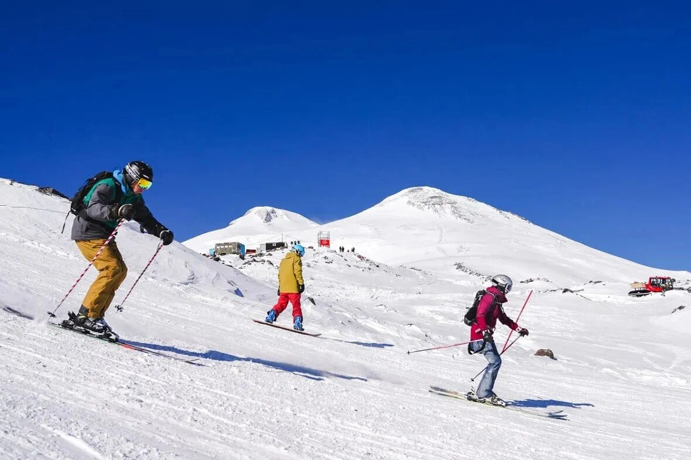
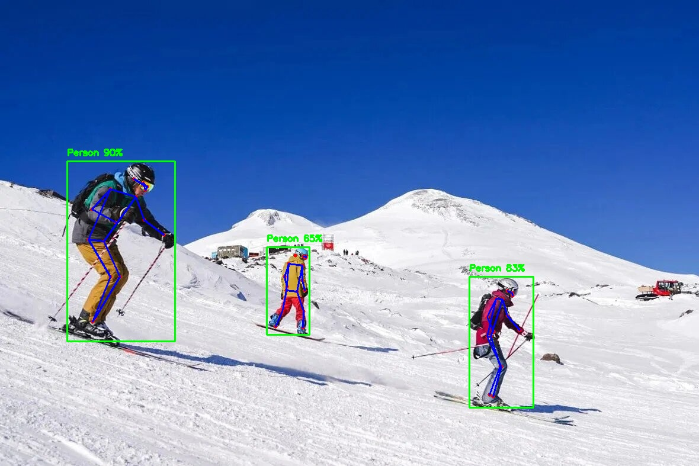
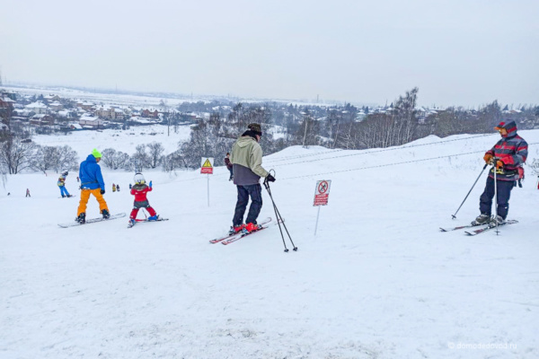
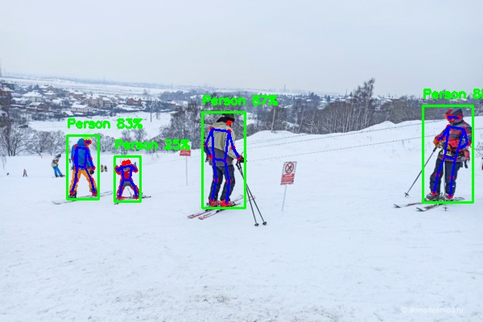

# 🚀 YOLO Pose Estimation (C++/ONNX Runtime/CPU/Docker)

**CPU** real-time human pose estimation using **YOLOv8/YOLO11 pose models** with **native C++**, **ONNX Runtime**, and **Docker deployment**.

## 🖼️ Example before / after

| Input | Pose Estimation |
|:-----:|:---------------:|
| <p align="center"></p> | <p align="center"></p> |
| <p align="center"></p> | <p align="center"></p> |

## 🎥 Demos
<p align="center">
  
  
  
</p>

## ✨ Features

- **Multi-model support**: YOLOv8n/YOLO11n pose ONNX models
- **Full pose pipeline**: letterbox → ONNX inference → NMS → 17 COCO keypoints + skeleton
- **Production CLI**: images/videos/webcam + output saving
- **Docker**: **2GB** (optimized, no PyTorch) / **23GB** (with ultralytics export)
- **Cross-platform**: Windows (Visual Studio) + Linux (Docker)

Tested on: Intel Xeon E5-2680 v4 @ 2.4GHz, 32GB RAM, Windows 10/11

## 🎯 Quick Start

### 1. Clone repository

```bash
git clone https://github.com/Shazy021/yolo-pose-cpp.git
cd yolo-pose-cpp
```

### Docker (Recommended, 2GB image)


| Task | Command |
|------|---------|
| Build image | `docker compose build` |
| Image → image | `docker compose run --rm pose -i /app/data/test_1.jpg -o /app/output/res_1.jpg` |
| Video → video | `docker compose run --rm pose -i /app/data/test_vid.mp4 -o /app/output/res_vid.mp4` |
| Use YOLO11 | `docker compose run --rm pose -m /app/models/yolo11n-pose.onnx -i /app/data/test_2.jpg -o /app/output/res_y11.jpg` |

### Local (Windows)

| Task | Command (example) |
|------|-------------------|
| Image → image | `PoseEstimation.exe -i data\test_1.jpg -o output\res_1.jpg` |
| Video → video | `PoseEstimation.exe -i data\Test_vid.mp4 -o output\res_vid.mp4` |
| YOLO11 model | `PoseEstimation.exe -m models\yolo11n-pose.onnx -i data\test_2.jpg -o output\res_2.jpg` |
| Webcam | `PoseEstimation.exe -i 0` |

## 📦 Models

This repository uses **Git LFS** for ONNX models:

```
models/
├── yolov8n-pose.onnx # default model
└── yolo11n-pose.onnx # YOLO11 pose
```

You can either use these models or export your own from Ultralytics checkpoints.

### Export your own models (host, optional)

```bash
pip install ultralytics onnx
```
YOLOv8 pose → ONNX
```bash
python scripts/export_yolo_pose_onnx.py
--model yolov8n-pose.pt
--output-dir models
```

YOLO11 pose → ONNX
```bash
python scripts/export_yolo_pose_onnx.py
--model yolo11n-pose.pt
--output-dir models
```
Then:
```bash
docker compose run --rm pose
-m /app/models/your_model.onnx
-i /app/data/test_1.jpg
-o /app/output/res_custom.jpg
```
---

## 🧰 Optional: export models inside Docker (Ultralytics)

By default the image is lightweight (~2 GB) and does **not** include Ultralytics / PyTorch.  
If you need to export ONNX models **inside Docker**, there are two options.

### 1) Enable built-in export in Dockerfile (heavy image, ~23 GB)

In `Dockerfile` there is an optional block you can enable:

```
# ============================================
# Optional: export YOLO pose model to ONNX inside Docker
# RECOMMENDED: run scripts/export_yolo_pose_onnx.py on the HOST
# to avoid pulling heavy torch/ultralytics into the image.
#
# If you really need to export inside Docker, uncomment:
#
# COPY scripts/export_yolo_pose_onnx.py /app/scripts/
# RUN pip3 install ultralytics onnx
# RUN python3 /app/scripts/export_yolo_pose_onnx.py \
#        --model yolov8n-pose.pt \
#        --output-dir /app/models
# ============================================
```
After uncommenting and rebuilding, the image will:

- install `ultralytics` + `onnx` inside the container  
- export `yolov8n-pose.pt` → `yolov8n-pose.onnx` into `/app/models`

…but the image size will grow to roughly **23 GB**.

### 2) One-off export using an existing container

If you already have a container with Python and Ultralytics available, you can run the export script **once**.

Example (from project root on Windows, using the existing image):
```bash
docker run --rm ^
--entrypoint python3 ^
-v "%cd%/models:/app/models" ^
pose-estimation-cpu ^
/app/scripts/export_yolo_pose_onnx.py ^
--model yolov8n-pose.pt ^
--output-dir /app/models
```


The script will:

- call `YOLO("yolov8n-pose.pt")` inside the container  
- Ultralytics will download the checkpoint by name (if needed)  
- export it to `yolov8n-pose.onnx` and move it into `/app/models` (mapped to your local `./models`)  

You can replace `--model` with any other Ultralytics pose model name, e.g.:
```
--model yolo11n-pose.pt
```


For most users the recommended approach is still:

- export `.onnx` on the **host**, and  
- keep it in the main Docker image.
---

## 🏗️ Architecture

```
[Image/Video/Webcam] → input_handler → pipeline →
├── preprocess_letterbox (BGR→NCHW , letterbox scale/pad)
├── OnnxEngine (ONNX Runtime CPU, opset 12+)
├── yolo_pose_postprocess ( → Person structs + NMS)
└── visualize_results (bbox(green)+keypoints(red)+skeleton(blue))
```
---

## ⚠️ Limitations

- CPU-only (no CUDA / TensorRT yet)
- Fixed input size 640×640 (configurable in code yet)
- COCO 17-keypoint pose only

## 📄 License

MIT License
---

**CPU pose estimation**